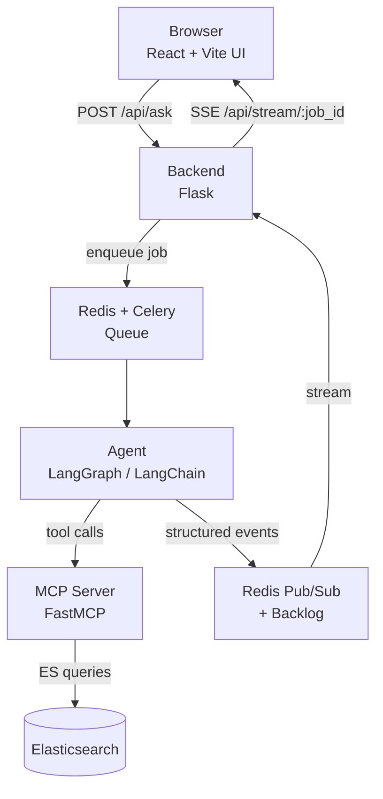
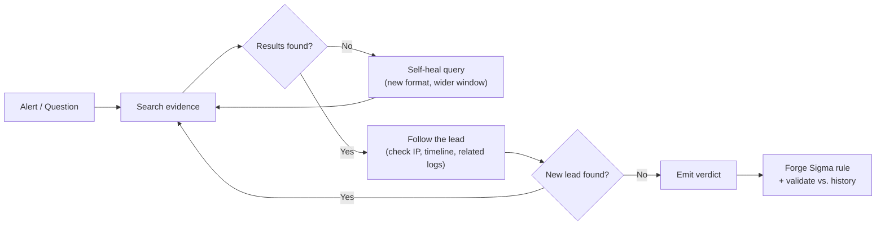
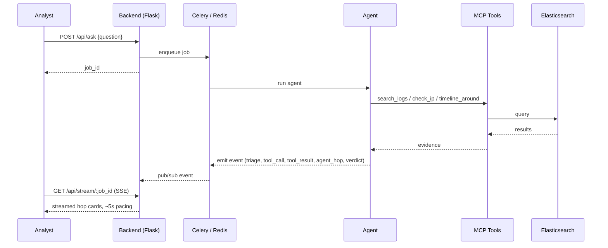

# Dossier

**The case file that builds itself.**

An autonomous investigation engine that turns a single noisy security alert into a fully correlated case file — automatically, and in real time. Dossier runs locally, streams its reasoning to the browser as it works, and can be wired to mock data, a live Elastic backend, or hosted models.

---

## The Problem

Security teams drown in alerts. A single suspicious login means an analyst has to manually check the IP against firewall logs, retry failed searches by hand, rebuild a timeline, and — if a phishing screenshot shows up — eyeball it and decide if it's real. That's a dozen manual steps and 20+ minutes, per alert, for a team that sees hundreds a day. Most alerts get a shrug, not because analysts are careless, but because there's no time to chase every thread to the end.

## The Solution

Dossier is an agent, not a dashboard. It investigates the way a senior analyst would — hopping from clue to clue on its own — but it does it at machine speed, and it shows its work the entire time.

- **Groups related evidence** across logs instead of showing isolated alerts
- **Prioritizes high-risk signals** so the most dangerous thread surfaces first
- **Produces an explainable investigation trace** — every hop, every tool call, every piece of evidence — for human review, streamed live rather than dumped at the end

---

## How It Works

### System architecture



Four layers, each with one job:

| Layer | Responsibility |
|---|---|
| **Frontend** (React + Vite) | Two-pane UI — Analyst Chat alongside the Agent's live reasoning trace ("hop cards") |
| **Backend** (Flask) | Transport only: session orchestration, job queueing, SSE streaming. No domain logic lives here. |
| **MCP** (FastMCP) | A narrow, strict tool contract — `search_logs()`, `check_ip()`, `timeline_around()` — that all Elastic queries route through |
| **Agent** (LangGraph + Gemma) | Plans, reasons, calls tools, and emits structured events as it goes |

### The investigation loop

This is what's actually happening inside a single run — the autonomous "hop" behavior that makes it an agent rather than a chatbot:



An empty search doesn't stop the agent — it retries with a different query shape. A found clue doesn't end the investigation — it triggers the next hop. The loop only closes once the agent has a verdict, and it doesn't stop there either: it turns the finding into a reusable detection rule.

### Runtime flow (single request, end to end)



Events stream incrementally on purpose — the point is to let a human watch the reasoning unfold, not wait for a black box to finish.

---

## Repo Layout

```
Agent/            # Planning graph, prompts, model client, vision helpers
backend/          # Flask service layer: routes, SSE, job/session handling, Celery glue
mcp/              # FastMCP server: strict tools that wrap Elastic queries
db/               # Mock-data generator, realtime log streamer, DB utilities
frontend/         # React + Vite UI
Plans/            # Design notes and the shared event/session contract
docker-compose.yml# Local Elasticsearch for demos
requirements.txt  # Root Python dependencies
```

Key files worth knowing:

- `backend/app.py` — HTTP API, SSE streaming, upload, timeline, and sigma endpoints
- `backend/tasks.py` — Celery task wrappers for agent runs and the Sigma forge routine
- `backend/mcp_client.py` — thin client that talks to MCP tools
- `mcp/server.py`, `mcp/es_client.py` — tool implementations issuing Elastic queries
- `Agent/graph.py`, `Agent/prompts.py` — the actual reasoning graph and prompts
- `Plans/00_SHARED_CONTRACT.md` — the event/session contract between agent and frontend

---

## Quickstart

**Prerequisites:** Python 3.10+, Node.js 18+/npm, a running `redis-server` (or hosted Redis URL), and optionally Docker for a local Elasticsearch instance.

**1. Clone and configure**
```bash
git clone <this-repo-url>
cd dossier
cp eg.env .env   # set ELASTIC_URL, ELASTIC_API_KEY, GEMMA_API_KEY as needed
```

**2. Install Python dependencies**
```bash
python -m venv venv
source venv/bin/activate     # Windows: venv\Scripts\activate
pip install -r requirements.txt
```

**3. Start Elasticsearch (optional, for real data)**
```bash
docker-compose up -d
```

**4. Start the MCP tool server**
```bash
python mcp/server.py
```

**5. Start the backend**
```bash
cd backend
./run.sh          # or: python app.py
```

**6. Start the frontend**
```bash
cd frontend
npm install
npm run dev
```

Open the Vite dev server URL and start an investigation from the chat panel.

---

## API Reference

```bash
# Enqueue a run
curl -s -X POST localhost:5000/api/ask -H 'Content-Type: application/json' \
  -d '{"question":"What IPs seem malicious today and why?"}' \
  | python3 -c 'import sys,json;print(json.load(sys.stdin)["job_id"])'

# Stream results (SSE)
curl -N localhost:5000/api/stream/<job_id>
```

| Endpoint | Purpose |
|---|---|
| `GET /api/health` | Dependency status — MCP, LLM, broker, Elastic config |
| `GET /api/job/<job_id>` | Job status and final result |
| `POST /api/upload` | Multimodal input (image, multipart or base64) — e.g. phishing screenshots |
| `POST /api/timeline` | Bypass the LLM, fetch a timeline directly from MCP |
| `POST /api/sigma` | Forge and validate a detection rule (streamed by default) |

**Operational note:** SSE must be delivered incrementally — disable proxy buffering (`X-Accel-Buffering: no`) and run the backend with threaded support enabled.

---

## Configuration

Single `.env` at the repo root, shared across all components:

| Variable | Purpose |
|---|---|
| `ELASTIC_URL`, `ELASTIC_API_KEY` | Elastic Cloud or local ES connection |
| `GEMMA_API_KEY` | Model provider key |
| `MCP_URL` | MCP server base URL (e.g. `http://127.0.0.1:8000`) |
| `REDIS_URL` | Redis broker/pub-sub URL |
| `FLASK_PORT` / `FLASK_ENV` / `PORT` | Backend port and environment |
| `DEMO_REPLAY` | Set to `1` to stream a cached run — demo escape hatch |
| `MOCK_DELAY_MS` | Speed up mock runs for testing |
| `STREAM_TIMEOUT_S` | SSE subscriber timeout |
| `CORS_ORIGINS` | Restrict allowed origins in production |

`/api/health` reports whether secrets are *present*, never their values.

---

## Tech Stack

- **Backend:** Flask (dev server + SSE)
- **Orchestration:** Celery + Redis + LangGraph / LangChain
- **Model:** Gemma family, via hosted provider
- **Tool layer:** FastMCP
- **Search:** Elasticsearch, ECS-formatted data
- **Frontend:** React + Vite
- **Notable libs:** `celery`, `redis`, `elasticsearch`, `langgraph`, `langchain`, `pillow` (vision), `python-dotenv`

---

## Demo & Mock Mode

- `mock_agent.py` scripts a complete narrative exercising every event type the frontend renders — useful for rehearsing without a live model.
- Set `DEMO_REPLAY=1` to replay a previously recorded run if the live model is unavailable on demo day.
- `db/generate_mock_data.py` creates ECS-like mock events; `db/view_db.py` / `db/clear_db.py` manage them.

**Swapping in the real agent:** the backend resolves `agent_bridge.run()` in this order — `DEMO_REPLAY` → `Agent/graph.py` (real agent) → mock agent. A real agent only needs to expose:

```python
def run(question: str, emit, image: bytes | None = None) -> dict
```

`emit(event_dict)` is the entire integration surface. Event shapes are defined in `Plans/00_SHARED_CONTRACT.md`.

---

## Testing

- Import `backend/postman_collection.json` for automated sanity checks (19 requests)
- `backend/EXPECTED_RESULTS.md` documents expected responses for each demo endpoint
- A correct run streams `triage → tool_call → tool_result → agent_hop → verdict` incrementally over ~5 seconds — never as a single dump

---

## Roadmap

- Improve Sigma rule parsing and shape (`backend/sigma.py`)
- Narrow `CORS_ORIGINS` for real deployments
- Add persistence and authentication beyond demo scope
- Expand MCP tool coverage against a production Elastic Cloud dataset

---

## Where to Look Next

- `Plans/00_SHARED_CONTRACT.md` — event and session contract
- `backend/readme.md` — backend boot and streaming notes
- `Agent/graph.py` / `Agent/prompts.py` — the reasoning graph
- `mcp/server.py` / `mcp/tools/` — tool definitions the agent calls
